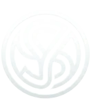

<div align="center">
<table width="100%">
<tr>
<td align="center" bgcolor="#0B1220">
<br />

<h1>SYNAPSE</h1>
<p><strong>Purpose-built tools for Roblox Studio.</strong></p>

<br />
<a href="https://create.roblox.com/store/asset/121407719443899?viewFromStudio=true&keyword=&searchId=ff92379b-5d8f-404a-8d87-b4e7c38b8f82"></a>
&nbsp;
<a href="https://create.roblox.com/store/asset/136370912247705/SynapseUiDesigner?viewFromStudio=true&keyword=&searchId=ff92379b-5d8f-404a-8d87-b4e7c38b8f82"></a>
<br /><br />
</td>
</tr>
</table>
</div>

<p align="center">


</p>

## The Toolkit

Synapse is a collection of Roblox Studio plugins designed to streamline everyday creator workflows: faster asset setup, cleaner UI creation, and more efficient iteration inside Studio.

| Plugin | What it does | Source |
| |:--|:--|
| **Synapse Tool Configurator** | Converts models and parts into ready-to-use Tools, with Handle setup, joints, Grip controls, attachments, validation, and optional backups. | [Browse source](./plugins/tool-configurator) |
| **Synapse UI Designer** | Builds and animates interfaces with a hierarchy, preview workspace, property inspector, timeline, easing, and reusable animation data. | [Browse source](./plugins/ui-designer) |

## Built for Real Workflows

<table>
<tr>
<td width="50%" valign="top">
<h3>Tool Configurator</h3>
<p>Prepare weapons, equipment, simulator items and other assets with a guided, reversible setup flow.</p>
<ul>
<li>Detects candidate Handles and validates the selection</li>
<li>Creates Motor6D or WeldConstraint joints</li>
<li>Configures Grip values and RightGripAttachment</li>
<li>Supports backups, protected objects and undo-aware actions</li>
</ul>
<p><a href="https://create.roblox.com/store/asset/121407719443899?viewFromStudio=true&keyword=&searchId=ff92379b-5d8f-404a-8d87-b4e7c38b8f82">Open in Creator Store</a></p>
</td>
<td width="50%" valign="top">
<h3>UI Designer</h3>
<p>Shape interfaces and animation timelines in a focused Studio workflow, using on-screen controls and context menus.</p>
<ul>
<li>Creates and organizes common UI objects</li>
<li>Edits keyframes, easing, events and properties</li>
<li>Previews ready-made animation effects</li>
<li>Saves and imports reusable animation data</li>
</ul>
<p><a href="https://create.roblox.com/store/asset/136370912247705/SynapseUiDesigner?viewFromStudio=true&keyword=&searchId=ff92379b-5d8f-404a-8d87-b4e7c38b8f82">Open in Creator Store</a></p>
</td>
</tr>
</table>

## Repository layout

```text
plugins/
    tool-configurator/
        SynapseToolConfig.luau
        Modules/
    ui-designer/
        SynapseUiDesigner.luau
        Modules/
CONTRIBUTING.md
CHANGELOG.md
DEVELOPMENT.md
LICENSE
README.md
```

Each plugin keeps its entry point and feature modules together for easier review and maintenance.

## Development

No build step is required for these plugins. They are designed to run directly inside Roblox Studio from source.

### Recommended workflow

1. Open Roblox Studio.
2. Open the plugin source folder you want to work on.
3. Load the entry script, such as:
   - `plugins/tool-configurator/SynapseToolConfig.luau`
   - `plugins/ui-designer/SynapseUiDesigner.luau`
4. Use Studio's plugin tooling to run and test the plugin in a live place.
5. Validate behavior in a test place before opening a pull request.

For a complete development guide, see [DEVELOPMENT.md](./DEVELOPMENT.md).

## Contributing

Please read [CONTRIBUTING.md](./CONTRIBUTING.md) before opening a pull request.

## License

This project is licensed under the [MIT License](./LICENSE).

## Changelog

See [CHANGELOG.md](./CHANGELOG.md) for version notes and release history.

<div align="center">

<sub>Designed for creators. Built for Roblox Studio.</sub>
</div>
